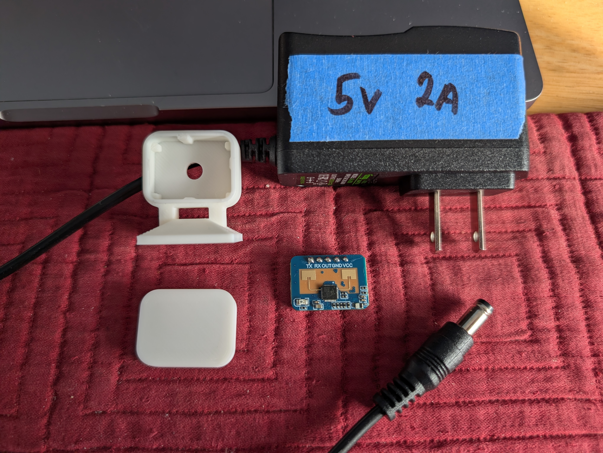
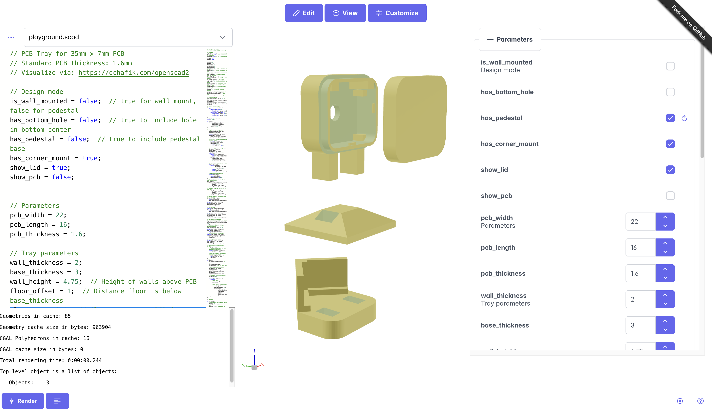
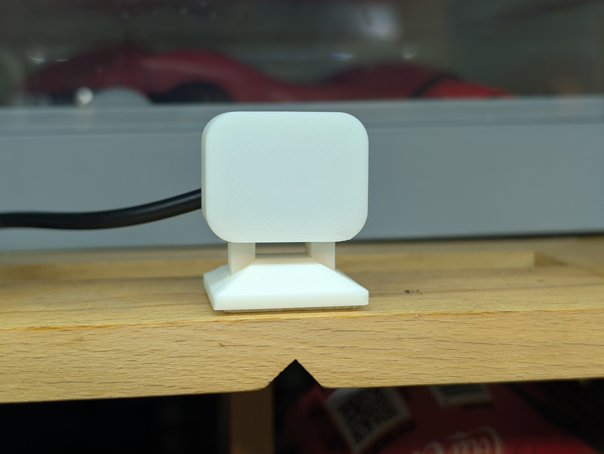
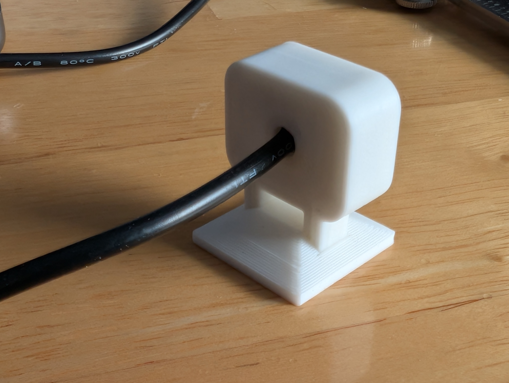
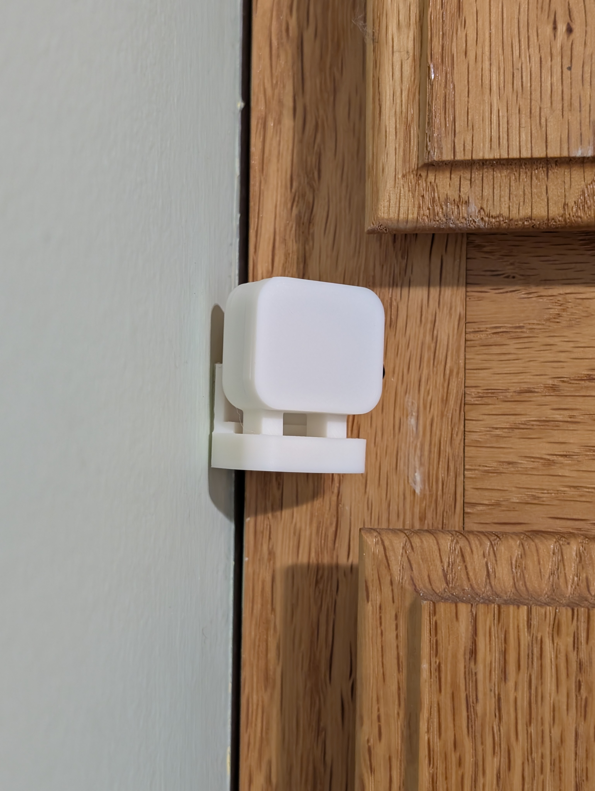
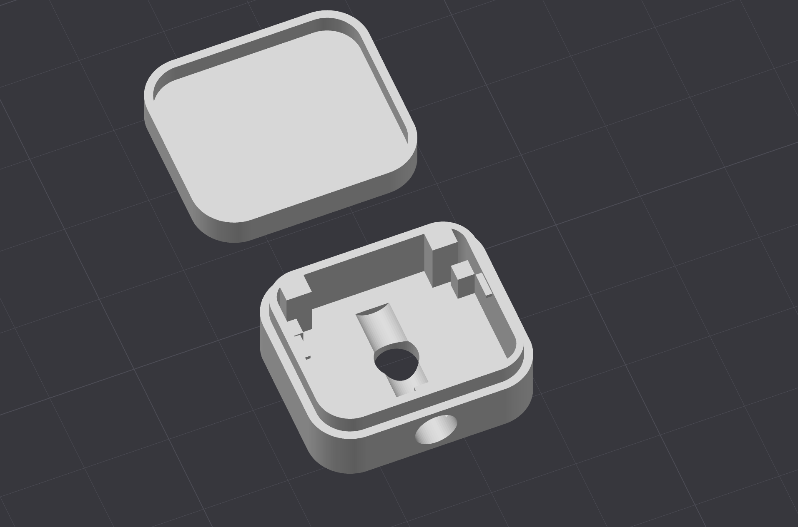
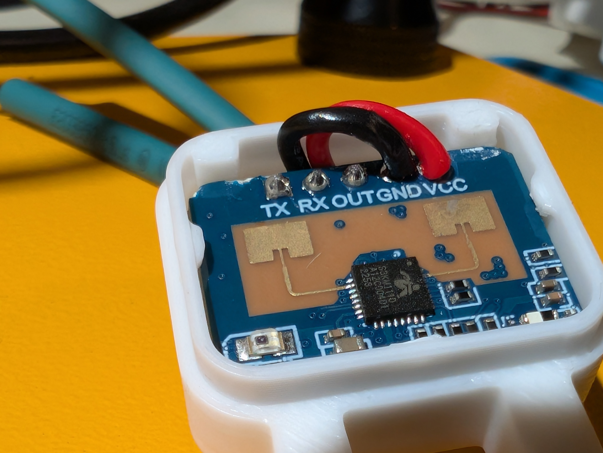

# ld2410 Human Presence Sensor Enclosure

The ld2410 sensor detects human presence even without movement. It broadcasts its data over bluetooth so it can be put to use as a standalone device with just a 5V power supply.

You can then read in the sensor data over bluetooth into Home Assistant to use in automations.

You can also directly connect an ld2410 to an esp32 via ESPHome and receive the data over UART rx/tx, but I find the simplicity of bluetooth to be preferrable (and it's only 2 wires -- VCC and GND -- vs 4 for UART). 

The placement of these sensors around the house is also much more flexible if they are just self-powered and self-broadcasting.

The 3d printed lid does not interfere with its detection abilities.

---

### Design variations
3d printable files include three variants:
* Freestanding pedestal
* Corner wall mount
* Flush wall mount

---

### Files
* [Customizable SCAD](files/ld2410_enclosure.scad)
* [All variants 3MF](files/ld2410_enclosure.3mf)
* STLs:
  * [Enclosure with feet](files/enclosure_with_feet.stl)
  * [Pedestal](files/pedestal.stl)
  * [Corner mount](files/corner_mount.stl)
  * [Flush wall mount enclosure](files/flush_wall_enclosure.stl)

---

### Components
* ld2410 human presence sensor
* 5V power supply
* solid core 20-22ga patching wire
* soldering iron, solder sucker, solder, flux
* pliers, wire stripper, wire/pin cutter

___

### Assembly

Remove the black plastic around the headers using a pair of pliers.

Desolder the GND and VCC pins (see [this tutorial](https://www.youtube.com/watch?v=ATeRNgOUX3o&t=114s) for help).

Cut off the remaining pins.

Feed solid core wire through the pin holes and solder in place. I found it easier to apply flux to the back side of the pcb and solder the wires there; soldering them at the front side of the board did not take the flux as easily due to existing solder residue.

Snap the ld2410 into place. There is clearance at the top edge of the board to pass the wires through.

Feed the wires through the enclosure's exit hole.

I then cut off the barrel connector from the power supply and then soldered the leads to the solid core wires and sealed them with heat shrink tubing.

---

### Configuration and Communication
Position the sensor and then adjust its range and sensitivity using the HLKRadarTool app ([Android](https://play.google.com/store/apps/details?id=com.hlk.hlkradartool&hl=en_US), [iOS](https://apps.apple.com/us/app/hlkradartool/id1638651152)).

I set up a `bluetooth_proxy` in ESPHome so that a wifi-connected esp32-s3 uses its antenna to both communicate with Home Assistant and relay data from bluetooth devices.

Home Assistant has a HACS integration to read this bluetooth sensor data: `ha-ld2410`. See: https://www.youtube.com/watch?v=7-VV-X5BpNo